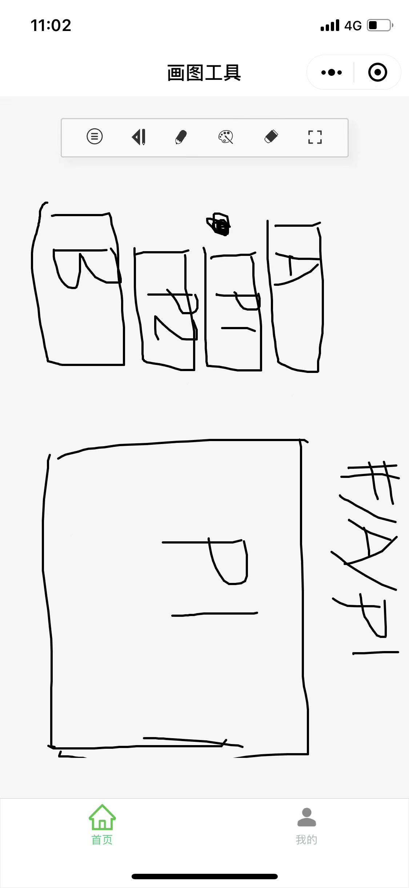
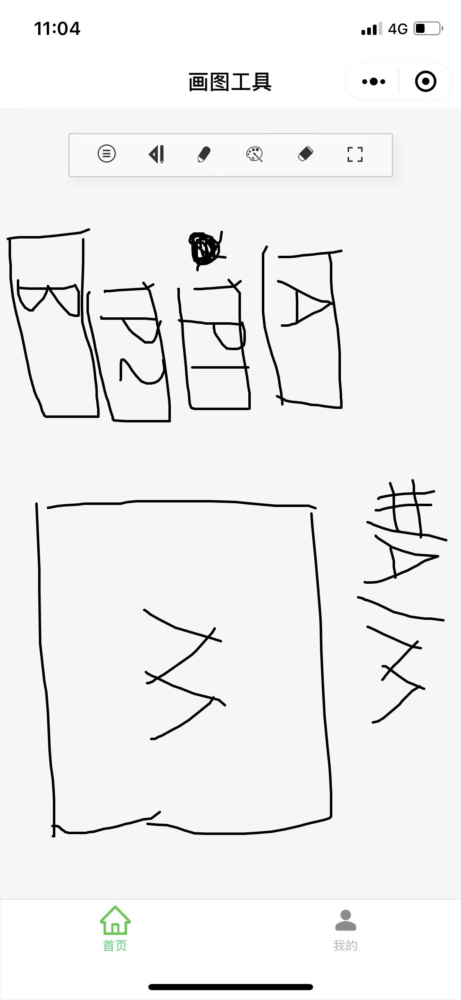

# 该项目是vue-router的问题

# 问题描述

```
有个vue-router的后台管理项目，左侧是菜单栏右边是内容区。
```





```
现在开发好了两个子组件页面P1和M。 
怎么实现访问#/A/P1 和#/A/M组件 页面可以正常看到对应组件内容，要保证访问这两个页面左侧二级菜单能够高亮？

说明：
1） 访问的途径有 地址栏输入地址、菜单栏点击、其它页面跳转
2） 由于M页面是要有参数，所以不能直接放在二级菜单上，所以目前考虑了通过路径切换组件
```